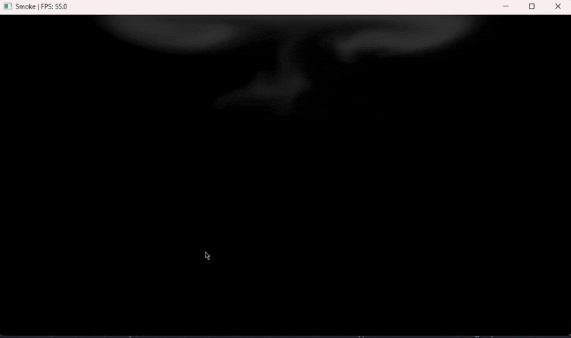

# 2D-Smoke-Simulator-using-OpenGL-on-the-CPU
A hobby project made using C, OpenGL/GLAD and GLSL. The real time simulator runs on the CPU. Based on the paper "Real-Time Fluid Dynamics for Games" by Jos Stam. 



## Table of Contents
* [Approach](#approach)
* [Input Method](#input-method)
* [Building and Running](#building-and-running)
  * [Prerequisites](#prerequisites)
  * [Installing Dependencies](#installing-dependencies)
  * [Build Instructions](#build-instructions)
  * [Troubleshooting](#troubleshooting)
* [Resources](#resources)

## Approach
The fluid simulation implements the Navier-Stokes equation for incompressible flow. The movement of the fluid is based on the Semi-Lagrangian method for Advection.
The simulation follows the following structure:
1. Add Source/Force by user input.
2. Diffusion to neighboring cells via Gauss-Seidel iteration.
3. Advection based on the Semi-Lagrangian method.
4. A Poisson solver to make the fluid incompressible.
A diffusion was also impemented to reduce screen clutter and dampen velocity.

## Input Method
Left clicking the mouse will add the Fluid (smoke). Moving the mouse around will move the smoke.

## Building and Running

### Prerequisites
- **CMake** (3.10 or higher)
- **C compiler** (GCC, Clang, or MSVC)
- **OpenGL** (usually pre-installed)
- **GLFW3** - Window and input handling library

#### Installing Dependencies

**Ubuntu/Debian:**
```bash
sudo apt-get update
sudo apt-get install cmake build-essential libglfw3-dev
```

**Fedora/RHEL:**
```bash
sudo dnf install cmake gcc glfw-devel
```

**MacOS:**
```bash
brew install cmake glfw
```

**Windows:**
- Install [CMake](https://cmake.org/download/)
- Install [GLFW](https://www.glfw.org/download.html) or use vcpkg:
```bash
vcpkg install glfw3:x64-windows
```

### Build Instructions

#### Linux/MacOS
```bash
# Clone the repository
git clone https://github.com/Feature-bug/2D-Smoke-Simulator-using-OpenGL-on-the-CPU.git
cd 2D-Smoke-Simulator-using-OpenGL-on-the-CPU

# Create build directory
mkdir build
cd build

# Configure with CMake
cmake ..

# Build
make

# Run
./build/Release/smoke_simulator.exe
```

#### Windows (Command Prompt)
```bash
# Clone the repository
git clone https://github.com/Feature-bug/2D-Smoke-Simulator-using-OpenGL-on-the-CPU.git
cd 2D-Smoke-Simulator-using-OpenGL-on-the-CPU

# Create build directory
mkdir build
cd build

# Configure with CMake
cmake ..

# Build
cmake --build . --config Release

# Run
Release\smoke_simulator.exe
```

### Troubleshooting

**"Could not find GLFW"**: Make sure GLFW3 is installed
- Linux: `sudo apt-get install libglfw3-dev`
- Mac: `brew install glfw`
- Windows: Use vcpkg or download from glfw.org

**OpenGL errors**: Ensure your graphics drivers are up to date

## Resources
 - Joe Stam's "Real-Time Fluid Dynamics for Games" - https://www.dgp.toronto.edu/public_user/stam/reality/Research/pdf/GDC03.pdf
 - Ten Minute Physics - https://www.youtube.com/watch?v=iKAVRgIrUOU
 - Sabastian Lague - https://www.youtube.com/watch?v=Q78wvrQ9xsU

No part of the code in this repository was generated by AI. All the work in this repository was written by a human.

Licensed under the MIT License
